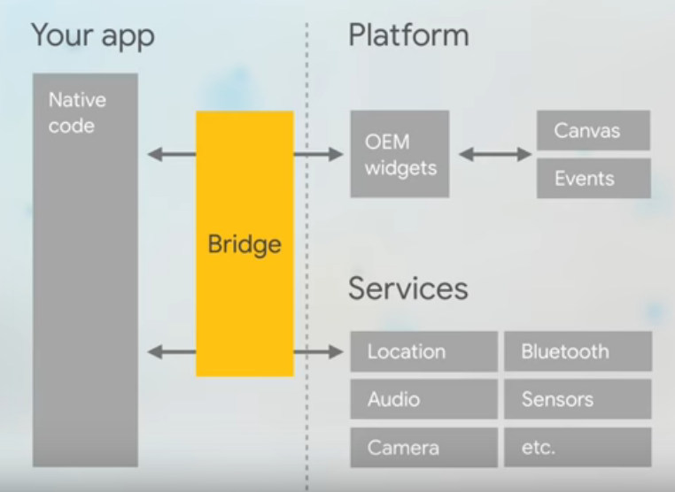
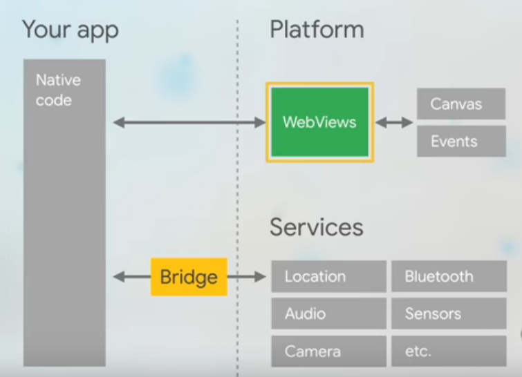
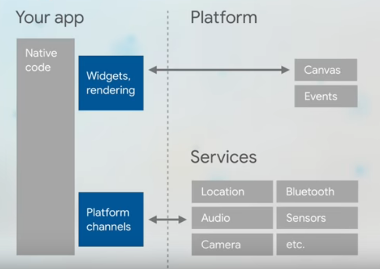

## Comparing React Native, Ionic and Flutter

|Metric| React Native  |     Ionic     |     Flutter     |
|------| ------------- | ------------- |-----------------|
| **Developed By** | Facebook | Drifty Co.  | Google  |
| **Used in**  | [Instagram](https://www.instagram.com/), [Facebook](https://www.facebook.com/), [UberEats](https://www.ubereats.com/) |  [MarketWatch](https://www.marketwatch.com/), [Pacifica](https://www.pacificacompanies.co.in/),[Sworkit](https://sworkit.com/)  | [Alibaba](https://www.alibaba.com/?src=sem_ggl&cmpgn=8652583628&adgrp=88567885882&fditm=&tgt=kwd-14739453&locintrst=&locphyscl=9040199&mtchtyp=e&ntwrk=g&device=c&dvcmdl=&creative=406886227602&plcmnt=&plcmntcat=&p1=&p2=&aceid=&position=&gclid=CjwKCAjwwYP2BRBGEiwAkoBpAre5FTQpdiA5E2bTIXZYY3BhUuGaht4Fta1rMnaHEY7y6gWTIQ_uFRoCmcAQAvD_BwE), [Birch Finance](https://birchfinance.com/), [Reflectly](https://reflectly.app/) |
| **Programming language** |  React library and JavaScript  | HTML, CSS, JavaScript and [Cordova Plugin](https://github.com/ionic-team/cordova-plugin-ionic)  | [Dart](https://dart.dev/)  |
| **Community Support**  | Strong Community Support with numerous active users helping eachother  | Since it was built on AngularJS almost 7 years ago, its backed by a strong community as well |  Relatively new, so as compared to the other two, has a weaker community support |
| **Performance**| React Native lets you build an application that provides native look-and-feel by invoking native APIs and components through a JS Bridge. Whenever the user interacts with the application or the application changes its state on it own, which can be as frequent as 60 times a second, the application has to communicate to the platform rendering the application through a bridge. This gives rise to performance implications.  |    Ionic is different than other frameworks as it uses web technologies like HTML, CSS, and JavaScript to create hybrid cross-platform apps. It needs plugins and third-party packages to wrap your application in native cover so its slower than React Native. It creates web views of your application and displays them in your platform and communicates to services like cameras and geolocation through a bridge.   |  Flutter goes a step ahead because there is no native transition or some bridges to connect with the native environment. Flutter eliminates the bridge or any context switch needed to go from your app to a specific platform and moves the rendering in your application! All it requires of the platform is a canvas to render the widgets so that they can appear on the device screen and access to events like fingertaps and services like bluetooth, camera, etc.  |
| **Front-end Support** | A decent set of built-in components is provided but a lot of them need to be styled by you. And they’re non-adaptive, instead — just as with Flutter — you get alternatives for both operating systems. | Ionic UI doesn’t utilize native elements at all and renders everything in HTML and CSS. Then it applies Cordova to give native mobile experience. Ionic in its core has a huge set of pre-built (and pre-styled) components, so developing cool UIs is pretty easy. |  Flutter also ships with a comprehensive suite of built-in widgets. These aren't platform adaptive so extra effort is required if you want them to look differently in different platforms. |
| **Code Reusabilty** | Once coded components can be re-used wherever in the application.   | Awesome re-usability! The “wrapped web app” concept ensures that you can easily re-use your code — you’re just building a wrapped web app in the end.  | Just like React Native, FLutter has reusable widgets which are displayed in the application just the way you code them, i.e., they don't adapt to the underlying platform. |
| **Accessing Native Device Features**  | Being the most popular solution, you find a rich set of third-party packages as well as some built-in APIs for accessing native platform functionalities. Relying on third-party packages (which you mostly have to do) of course has the disadvantage that the core maintainers of that package might quit, hence the support is not on the same level as it is with Ionic or NativeScript |  Ionic uses Cordova or its own solution, Capacitor, to give you access to native device features. It provides a very decent set of packages to access common native device functionalities like the camera. Also, Ionic/Cordova and/or Angular plugins are very stable, and update readily with platform updates. | Over the last year, the Flutter team put a lot of effort into providing official packages for some of the most common native device features you need access to. There also is a very vibrant ecosystem and hence you find a package for pretty much any native feature you might want to access. |
|**Code Testing**|  Needs a real mobile device or emulator to test the code. Also has a feature of debugging the code in browser through chrome debugging tools and establishing a web socket connection between the device and browser for real-time debugging. | Using any browser, the code can be tested | Needs a real mobile device or emulator to test the code. It also provide Dart debugging tools which can be opened in the browser to give an in-and-out performance report of the application but absence to socket connections leads to frequent reloading of the pages.   |
| **Popularity**  | React Native is more popular than the other two as many tech giants are using it in their production environment including Facebook, Instagram, Pinterest, Skype, Tesla, Uber, Walmart, Salesforce, Vogue | Ionic is very popular among web and mobile app developers due to its easy learning curve. It is used by MarketWatch, Pacifica, Sworkit, Nationwide, and many more | Flutter has just entered the market but grown in popularity in very less time. It is used by Alibaba, Hamilton Musical, Greentea, Google Ads  |
| **Supported Platforms** | Android 4.1+ , iOS 8+, UMP | Android 4.4+ , iOS 8+ , Windows 10  | Android 4.1+, iOS 5+, Google Fuchsia  |
| **Open Source** | Yes | Yes, a Pro Development environment is also offered which is paid. | Yes |
|**Documentation**| Up-to-date but imprecise  |   Precise, Clear, up-to-date | Precise, Clear, up-to-date  |
| **Learning Curve**  | Steep Learning Curve |  Easy Learning Curve due to web technologies like Angular and TypeScript | Steep Learning Curve |
|**Time-to-Market of App**| Slower as compared to the other two | Faster than React, Slower than Flutter | Fastest among the three |
|**Error Reporting**| Really messy! | Compact and readable  | Compact and readable  |

### To Summarize

**Choose Flutter when you want cross-platform, highly-attractive UI, excellent native performance, quicker time-to-market, and competitive advantage of using Dart in your programming environment. 
Choose React Native when you want to leverage the support from the stronger and mature community, native app performance, and popular JavaScript in developing cross-platform apps 
If you are low on budget and want excellent performance, you can opt for Ionic**

